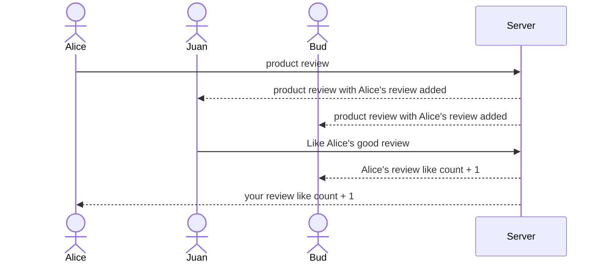

# BestNow

## Specification Deliverable

### Elevator pitch

At BestNow, we understand the frustration of spending countless hours searching for trustworthy product reviews across multiple websites, only to be bombarded by ads and conflicting opinions. That's why we've created a platform that does the hard work for you. BestNow aggregates trending, highly rated products from trusted sources, presenting a clear, concise view of what actual users say. Whether you're looking for the latest gadget or a daily essential, BestNow helps you make confident decisions quickly and easily by showing you the best products.

### Design

Here is a sequence diagram that shows how to people would interact with the backend to vote.

### Key features

- Secure login over HTTPS
- Collect data about a product reviews
- display the reviews
- Ability to let users like a review
- Display the number of likes a review has
- Ability to sort reviews by number of likes
- Ability for users to add reviews
- Ability for users to edit/delete reviews
- People can see the reviews from different site in real time

### Technologies

I am going to use the required technologies in the following ways.

- **HTML** - Uses correct HTML structure for application. Start with three HTML pages. One for login and one for write reviews, and one for displaying reviews.
- **CSS** - Application styling that looks good on different screen sizes, uses good whitespace, color choice and contrast.
- **React** - Provides login, choice display, display the product reviews data from different site, and use of React for routing and components.
- **Service** - Backend service with endpoints for:
  - login
  - retrieving review data
  - submitting new reviews
- **DB/Login** - Store users, people's reviews in database. Register and login users. Credentials securely stored in database. Can't review a product unless authenticated.
- **WebSocket** - As each review got liked, their likes are broadcast to all other users.

## HTML deliverable

➡️ The following is an example of the required information for the `Startup HTML` deliverable

- [ ] **HTML pages** - Three HTML page that represent the ability to login and display reviews and write reviews.
- [ ] **Links** - The login page automatically links to the Home page(home page contains product review products). The Home page has a link to the write review page.
- [ ] **Text** - The login page has a login form. The Home page has a list of products with reviews. The write review page has a form to write a review.
- [ ] **Images** - Images will be added for represent the products.
- [ ] **DB/Login** - Input box and submit button for login. The voting choices represent data pulled from the database.
- [ ] **WebSocket** -

## CSS deliverable

➡️ The following is an example of the required information for the `Startup CSS` deliverable

- [ ] **Header, footer, and main content body**
- [ ] **Navigation elements** -
- [ ] **Responsive to window resizing** -
- [ ] **Application elements** -
- [ ] **Application text content** -
- [ ] **Application images** -

## React deliverable

➡️ The following is an example of the required information for the `Startup React` deliverable

- [ ] **Bundled and transpiled** -
- [ ] **Components** -
  - [ ] **login** -
  - [ ] **database** -
  - [ ] **WebSocket** -
  - [ ] **application logic** -
- [ ] **Router** -
- [ ] **Hooks** -

## Service deliverable

➡️ The following is an example of the required information for the `Startup Service` deliverable

- [ ] **Node.js/Express HTTP service** -
- [ ] **Static middleware for frontend** -
- [ ] **Calls to third party endpoints** -
- [ ] **Backend service endpoints** -
- [ ] **Frontend calls service endpoints** -

## DB/Login deliverable

➡️ The following is an example of the required information for the `Startup DB/Login` deliverable

- [ ] **MongoDB Atlas database created** -
- [ ] **Stores data in MongoDB** -
- [ ] **User registration** -
- [ ] **existing user** -
- [ ] **Use MongoDB to store credentials** -
- [ ] **Restricts functionality** -

## WebSocket deliverable

➡️ The following is an example of the required information for the `Startup WebSocket` deliverable

- [ ] **Backend listens for WebSocket connection** -
- [ ] **Frontend makes WebSocket connection** -
- [ ] **Data sent over WebSocket connection** -
- [ ] **WebSocket data displayed** -

## Notes

For more details on what I learned, check out my [notes.md](./notes.md).
