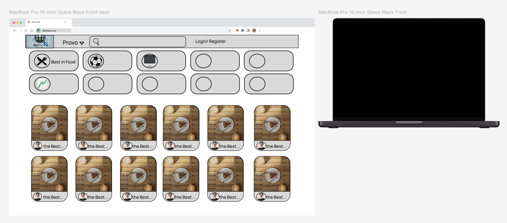
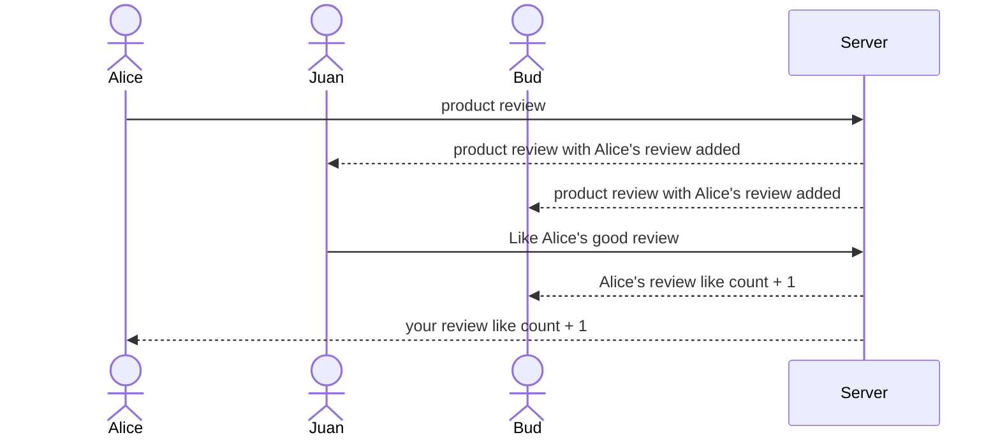

# BestNow

## Specification Deliverable

### Elevator pitch

At BestNow, we understand the frustration of spending countless hours searching for trustworthy product reviews across multiple websites, only to be bombarded by ads and conflicting opinions. That's why we've created a platform that does the hard work for you. BestNow aggregates trending, highly rated products from trusted sources, presenting you with a clear, concise view of what real users are saying. Whether you're looking for the latest gadget or a daily essential, BestNow helps you make confident decisions quickly and easily by showing you the best products, right now.

### Design

Here is a sequence diagram that shows how to people would interact with the backend to vote.

### Key features

- Secure login over HTTPS
- Collect data about a product reviews
- display the reviews
- Ability to let users like a review
- Display the number of likes a review has
- Ability to sort reviews by number of likes
- Ability for users to add reviews
- Ability for users to edit/delete reviews
- People can see the reviews from different site in real time

### Technologies

I am going to use the required technologies in the following ways.

- **HTML** - Uses correct HTML structure for application. Three HTML pages. One for login and one for write reviews, and one for displaying reviews.
- **CSS** - Application styling that looks good on different screen sizes, uses good whitespace, color choice and contrast.
- **React** - Provides login, choice display, display the product reviews data from different site, and use of React for routing and components.
- **Service** - Backend service with endpoints for:
  - login
  - retrieving review data
  - submitting new reviews
- **DB/Login** - Store users, people's reviews in database. Register and login users. Credentials securely stored in database. Can't review a product unless authenticated.
- **WebSocket** - As each review got liked, their likes are broadcast to all other users.

## HTML deliverable

➡️ The following is an example of the required information for the `Startup HTML` deliverable

For this deliverable I built out the structure of my application using HTML.

- [ ] **HTML pages** - Two HTML page that represent the ability to login and vote.
- [ ] **Links** - The login page automatically links to the voter page. The voter page contains links for every voting choice.
- [ ] **Text** - Each of the voting choices is represented by a textual description.
- [ ] **Images** - I couldn't figure out how to include an image and so I didn't do this. 😔
- [ ] **DB/Login** - Input box and submit button for login. The voting choices represent data pulled from the database.
- [ ] **WebSocket** - The count of voting results represent the tally of realtime votes.

## CSS deliverable

➡️ The following is an example of the required information for the `Startup CSS` deliverable

For this deliverable I properly styled the application into its final appearance.

- [ ] **Header, footer, and main content body**
- [ ] **Navigation elements** - I dropped the underlines and changed the color for anchor elements.
- [ ] **Responsive to window resizing** - My app looks great on all window sizes and devices
- [ ] **Application elements** - Used good contrast and whitespace
- [ ] **Application text content** - Consistent fonts
- [ ] **Application images** - Still don't have images and so no styling here. 😔

## React deliverable

➡️ The following is an example of the required information for the `Startup React` deliverable

For this deliverable I used JavaScript and React so that the application completely works for a single user. I also added placeholders for future technology.

- [ ] **Bundled and transpiled** - done!
- [ ] **Components** - Login, voting list, vote are all components with mocks for login, WebSocket.
  - [ ] **login** - When you press enter or the login button it takes you to the voting page.
  - [ ] **database** - Displayed the voting counts. Currently this is stored and retrieved from local storage, but it will be replaced with the database data later.
  - [x] **WebSocket** - I used the setInterval function to periodically increase a random vote count. This will be replaced with WebSocket messages later.
  - [x] **application logic** - The highlight and ranking number change based up the user's selections.
- [x] **Router** - Routing between login and voting components.
- [x] **Hooks** - Vue uses class properties instead of `UseState` to track changes in vote state.

## Service deliverable

➡️ The following is an example of the required information for the `Startup Service` deliverable

For this deliverable I added backend endpoints that receives votes and returns the voting totals.

- [x] **Node.js/Express HTTP service** - done!
- [x] **Static middleware for frontend** - done!
- [ ] **Calls to third party endpoints** - I didn't have time to implement this. 😔
- [x] **Backend service endpoints** - Placeholders for login that stores the current user on the server. Endpoints for voting.
- [x] **Frontend calls service endpoints** - I did this using the fetch function.

## DB/Login deliverable

➡️ The following is an example of the required information for the `Startup DB/Login` deliverable

For this deliverable I associate the votes with the logged in user. I stored the votes in the database.

- [x] **MongoDB Atlas database created** - done!
- [x] **Stores data in MongoDB** - done!
- [x] **User registration** - Creates a new account in the database.
- [x] **existing user** - Stores the votes under the same user if the user already exists.
- [x] **Use MongoDB to store credentials** - Stores both user and their votes.
- [ ] **Restricts functionality** - You cannot vote until you have logged in. This is restricted on the frontend only. 😔

## WebSocket deliverable

➡️ The following is an example of the required information for the `Startup WebSocket` deliverable

For this deliverable I used webSocket to update the votes on the frontend in realtime.

- [x] **Backend listens for WebSocket connection** - done!
- [x] **Frontend makes WebSocket connection** - done!
- [x] **Data sent over WebSocket connection** - done!
- [x] **WebSocket data displayed** - All user votes display in realtime. I'm really proud that this is working. Way cool!

## Notes

For more details on what I learned, check out my [notes.md](./notes.md).
